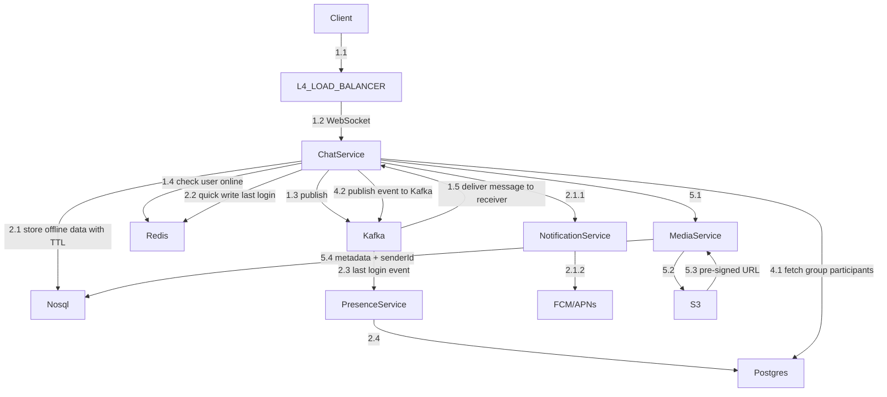

## 1. URL Shortener

### Requirements

- POST /shorten → returns short URL
- GET /:shortCode → redirects to original URL
- Read:Write ratio → 100:1

### Capacity Estimation

|Metric|Value|
|---|---|
|Write QPS|~1.2K/sec|
|Read QPS|~116K/sec|
|Storage (5yr)|~109 TB|
|Cache needed|~12 GB|
|Outbound bandwidth|~58 MB/s|

### Key Design Decisions

- **Cache** → Redis with LRU eviction (~12GB fits comfortably)
- **DB** → Sharded (109TB rules out single node)
- **Short code** → Base62 encoding of Snowflake ID → 7 chars
- **Read path** → CDN → Cache → DB Replica
- **Write path** → API → Shortener Service → DB Primary

### Key Design Signals

- 100:1 read:write → aggressive caching non-negotiable
- 109 TB → horizontal sharding required
- 12 GB cache → Redis LRU fits in single cluster

---

## 2. WhatsApp Messaging

### Requirements

**Functional**

- 1:1 messaging
- Group messaging (up to 1024 members)
- Delivery receipts → Sent ✓, Delivered ✓✓, Read ✓✓ (blue)
- Online / Last seen status
- Media sharing (images, video, documents)
- Push notifications when offline

**Non-Functional**

- Ultra low latency (<100ms)
- High availability
- Exactly-once delivery
- End-to-end encrypted
- Scale → 2 billion users, ~100B messages/day

### Capacity Estimation

|Metric|Value|
|---|---|
|DAU|500 million|
|Messages/day|15 billion|
|Write QPS|~174K/sec|
|Read QPS|~174K/sec (1:1 ratio)|
|Storage/day|1.5 TB|
|Total storage (30 days)|45 TB|
|DB choice|Cassandra|
|Sharding key|userId|

### Core Architecture Decisions

**Real-time Connection**

- WebSocket → persistent TCP connection per client
- Each chat server holds ~50K connections
- 2B users / 50K = ~40,000 chat servers needed

**Message Routing — Pub/Sub**

- Each user has a Redis Pub/Sub channel (NOT Kafka — too heavy, ~50KB overhead per topic)
- Sender publishes to receiver's channel
- Receiver's chat server is subscribed → delivers via WebSocket
- Kafka used only for async events (analytics, presence updates)

> ⚠️ Kafka per-user topic = bad idea → 1B users × 50KB = 50TB overhead just for topics

**Delivery Receipts**

```
Message arrives at receiver's chat server
→ Chat server delivers to receiver via WebSocket
→ Publishes DELIVERED event to sender's channel
→ Sender's chat server sends ✓✓ via WebSocket
```

Receipt event structure:

```json
{
  "type": "DELIVERED",
  "messageId": "uuid",
  "to": "userA"
}
```

**Group Messaging — Hybrid Fan-out**

|Group size|Strategy|
|---|---|
|Small (≤16)|Fan-out at write time → publish to each member's queue|
|Large (500)|Fan-out at read time → one group queue, members pull|

**Offline Message Storage**

- DynamoDB / Cassandra with TTL (30 days)
- Schema:

```
PK: receiverId
SK: messageId (Snowflake → naturally time-ordered)
Fields: content, senderId, groupId, status, ttl
```

**Presence Service — Two Tier**

```
Online  → Redis (real-time, in-memory, heartbeat TTL)
Offline → Kafka event → Presence Worker → Postgres (last seen history)
```

**ID Generation**

- Snowflake ID → embeds timestamp + server ID + sequence
- Guarantees global ordering without central coordinator

### Architecture Flows (Mermaid)



### E2E Encryption — Interview Points

**Core concept**

> Only sender and receiver can read messages. Server stores and forwards encrypted ciphertext — never sees plaintext.

**Key Exchange**

```
User A encrypts message with User B's PUBLIC key (fetched from Key Server)
Only User B's PRIVATE key (never leaves device) can decrypt
```

**New device scenario**

- New phone = new private key generated
- Old messages permanently unreadable (forward secrecy)
- WhatsApp shows "Security code changed" notification

**Group E2E — Sender Key**

```
Group created → generate one Sender Key
Distribute to all members (encrypted individually with each member's public key)
Messages encrypted once with Sender Key
All members decrypt with same Sender Key
```

**One-liner for interview**

> "WhatsApp uses the Signal Protocol — asymmetric keys for key exchange, symmetric encryption for messages, keys never leave the device, server only sees ciphertext"

---

## 3. Redis Deep Dive

### Data Structures — Quick Reference

|Structure|Analogy|Best for|
|---|---|---|
|String|Variable|Counters, simple values, cached HTML|
|Hash|DB row|Objects with fields (session, user profile)|
|List|Linked list|Queues, activity feeds, chat history|
|Set|Unique collection|Tags, unique visitors, friend lists|
|Sorted Set (ZSet)|Set + score|Leaderboards, rankings, rate limiting|
|Bitmap|Bit array|Daily active users, feature flags|
|HyperLogLog|Probabilistic counter|Approximate unique visitor count|
|Geo|Location store|Nearby drivers, store locator|
|Stream|Append-only log|Event sourcing, lightweight Kafka|

### Decision Tree

```
Single value?               → String
Object with fields?         → Hash
Queue or feed?              → List
Unique items, no order?     → Set
Unique items + ranking?     → Sorted Set (ZSet)
Location data?              → Geo
Yes/no per user/day?        → Bitmap
Approximate unique count?   → HyperLogLog
Event log?                  → Stream
```

---

### Problem 1 — Session Storage

**Structure:** Hash

```
Key:   session:{session_id}
Value: Hash {
    userId:    "u_123"
    email:     "atul@gmail.com"
    role:      "admin"
    createdAt: "1234567890"
    lastUsed:  "1234567999"
}
TTL: 1800 seconds (30 minutes, sliding window)
```

**Sliding window TTL**

- Each API request → `EXPIRE session:abc 1800` → resets TTL
- Session stays alive as long as user is active

---

### Problem 2 — Rate Limiting

**Structure:** Sorted Set (ZSet) — Sliding Window Log algorithm

```
Key:    ratelimit:{userId}
Member: requestId
Score:  timestamp of request
```

**Every API request:**

```
1. ZADD ratelimit:u123 <now> <requestId>
2. ZREMRANGEBYSCORE ratelimit:u123 0 <now - 60s>   ← remove old requests
3. ZCARD ratelimit:u123                             ← count in window
4. If count > 100 → 429 Too Many Requests
5. EXPIRE ratelimit:u123 60                         ← auto cleanup
```

**Fixed Window (String) vs Sliding Window (ZSet)**

||Fixed Window|Sliding Window|
|---|---|---|
|Memory|O(1)|O(n) per user|
|Accuracy|❌ boundary bug|✅ precise|
|Speed|O(1)|O(log n)|

> ⚠️ Fixed window bug: 100 requests at t=59s + 100 at t=61s = 200 requests in 2 seconds

---

### Problem 3 — Leaderboard

**Structure:** Sorted Set (ZSet)

**Key commands:**

```
ZADD leaderboard 9500 "u_001"          ← add/update score, O(log n)
ZREVRANGE leaderboard 0 99 WITHSCORES  ← top 100 players, highest first
ZREVRANK leaderboard "u_001"           ← player's rank (0-based), O(log n)
ZSCORE leaderboard "u_001"             ← player's score
```

**Scale problem — 10K writes/second**

- Single Redis key handles ~100K ops/sec → 10K writes is fine
- At higher scale → shard by player ID:

```
leaderboard:shard_A  → players A-D
leaderboard:shard_B  → players E-K
leaderboard:shard_C  → players L-R
leaderboard:shard_D  → players S-Z
```

Then merge top 100 from each shard → global top 100

**One-liner for interview**

> "Redis ZSet — ZADD to update, ZREVRANGE for top 100, ZREVRANK for instant global rank. Single ZSet handles 10K writes/sec fine. At higher scale shard by player ID and merge top N."

---

### Problem 4 — Geo Location (Uber Nearby Drivers)

**Structure:** Redis GEO (built on ZSet internally)

**How Geohashing works**

- Locations close to each other → similar geohash strings (shared prefix)
- Mumbai & Pune share "te7" → nearby
- Mumbai & Delhi share nothing → far

**Key commands:**

```
GEOADD drivers 72.8777 19.0760 "driver:d_001"   ← add/update location
GEORADIUS drivers 72.8777 19.0760 5 km           ← find drivers within 5km
GEODIST drivers user_loc driver:d_001 km         ← distance between two points
```

**Full Uber flow:**

```
Driver opens app
→ Every 5 seconds: GEOADD drivers <lng> <lat> "driver:d_001"

User requests ride
→ GEORADIUS drivers <user_lng> <user_lat> 5 km ASC COUNT 10
→ Returns 10 nearest drivers sorted by distance
→ Assign closest available driver
```

**Scale problem — 5M active drivers**

```
5M drivers × update every 5s = 1M writes/second → too hot for one key
```

Solution → **Shard by city:**

```
drivers:mumbai
drivers:delhi
drivers:bangalore
```

**Redis GEO vs ZSet manually**

||Redis GEO|ZSet manually|
|---|---|---|
|Radius search|✅ built in|❌ complex math|
|Custom scoring|❌|✅|
|Simple nearby|✅|❌ overkill|

---

## Interview One-liners Cheatsheet

|Topic|One-liner|
|---|---|
|WebSocket vs Polling|"WebSocket = persistent full-duplex TCP. Polling wastes bandwidth with empty requests. Long polling is better but still one-directional."|
|Redis Pub/Sub vs Kafka|"Redis Pub/Sub is in-memory, no persistence, lightweight. Kafka is disk-based, ordered, durable. Use Redis for real-time routing, Kafka for event streaming."|
|Snowflake ID|"64-bit ID = timestamp + datacenter ID + machine ID + sequence. Globally unique, time-ordered, no central coordinator."|
|Cassandra vs DynamoDB|"Both are wide-column NoSQL, write-optimized, horizontally scalable. Cassandra = open source, tunable consistency. DynamoDB = managed, built-in TTL, serverless."|
|Geohashing|"Converts 2D lat/long into a 1D string. Nearby locations share common prefixes. Enables efficient radius search without scanning all points."|
|E2E Encryption|"Signal Protocol — asymmetric keys for exchange, symmetric for messages. Keys never leave device. Server only sees ciphertext."|